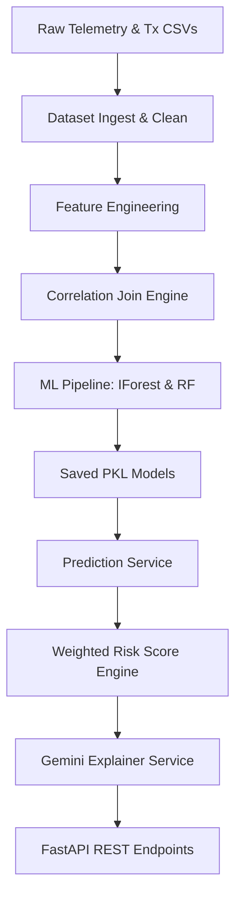

# CyberSense AI - System Architecture

CyberSense AI is an enterprise-grade AI-powered Cybersecurity Telemetry & Banking Transaction Correlation Platform. It integrates machine learning anomaly models, transaction risk scoring, and generative LLM explanations to protect financial ecosystems.

---

## 1. Modular System Design

The architecture is built on five core layers:
1.  **Ingestion & Loader Layer:** Recursively scans and discovers datasets, mapping heterogeneous schemas dynamically without hardcoded dependencies.
2.  **Telemetry Correlation Layer:** Aligns isolated activity datastreams (RBA logons, transactions, CERT workspace metrics, and IPS netflow captures) using multi-key sliding time-window joins.
3.  **Feature Orchestration Layer:** Computes continuous behavioral indicators, velocity, latency proxy VPNs, and user risk metrics.
4.  **AI/ML Inference Layer:** Runs dual-model predictions (Isolation Forest anomaly scores and class-balanced SMOTE Random Forest classifier probability scores).
5.  **LLM Security Narrative Layer:** Submits prediction contexts and inputs to Google Gemini to construct actionable incident reports and Root Cause analyses.

---

## 2. Component Pipeline Relationships

---

## 3. Storage & Integration Interface

*   **Database:** PostgreSQL stores user details, banking transactions, cybersecurity events, and real-time inference predictions logs.
*   **Model Store:** `app/ml/` houses serialized classifier weights (`isolation_forest.pkl` and `random_forest.pkl`).
*   **Web Console:** Next.js/Vite frontend displays real-time security alerts and risk metrics.
