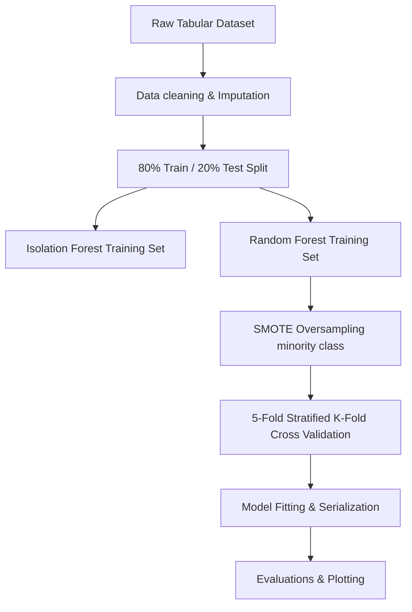

# CyberSense AI - ML Pipeline Design

This document details the Machine Learning pipeline design, data splitting strategies, class-imbalance oversampling algorithms, cross-validation parameters, and model persistence boundaries in CyberSense AI.

---

## 1. Pipeline Execution Flow

---

## 2. Oversampling (SMOTE) & Imbalance Handling

Banking transactions are highly skewed, with fraud representing less than 0.2% of occurrences. Training classifiers directly on imbalanced sets causes severe classification bias toward the majority class (legitimate transactions).
*   **Mechanism:** CyberSense AI employs **SMOTE (Synthetic Minority Over-sampling Technique)** to balance the dataset.
*   **Results:** SMOTE synthetically expanded the fraud transactions from **46** occurrences to **23,954** training rows, creating a balanced dataset for Random Forest tree splits.

---

## 3. Stratified Cross-Validation

To verify generalizability, the training pipeline executes a **5-Fold Cross-Validation** on the oversampled training datasets:
*   Folds partition the data into 5 distinct stratums.
*   **Mean CV F1 Score:** **99.67%**
*   This high stability confirms that the model generalizes robustly and does not suffer from overfitting.
